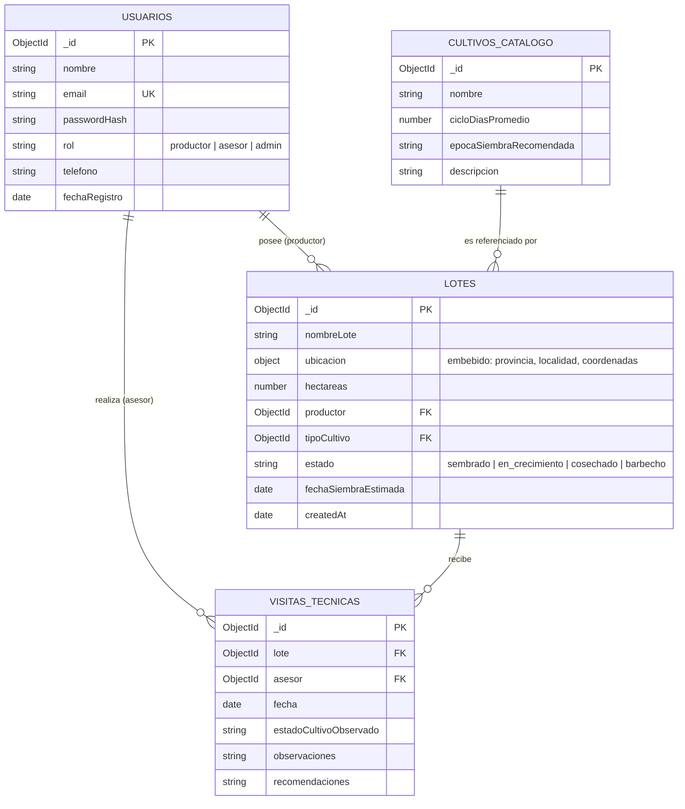
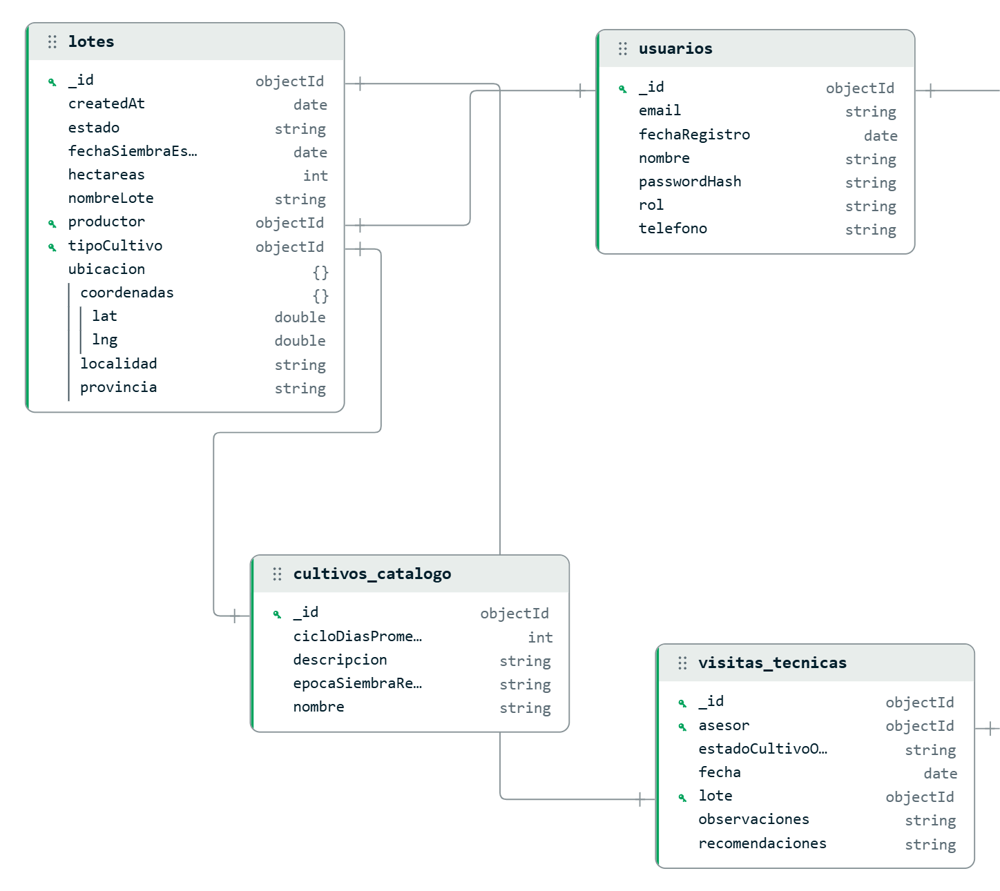

# Evaluación Bases de Datos: Diseño de Esquema
### Curso Avanzado Back-End — UTN
### Proyecto: Campo Argentino (plataforma de asesoría agropecuaria)

---

## 1. Elección del dominio

**Campo Argentino** es una plataforma de asesoría agropecuaria donde **productores** cargan sus lotes de campo y **asesores técnicos** los visitan y dejan recomendaciones sobre el cultivo en curso; un **administrador** gestiona usuarios y el catálogo de cultivos.

---

## 2. Diagrama del modelo



**Relaciones del modelo:**
- `Lotes.productor` → `Usuarios` (1:N — obligatoria, Usuario↔Entidad Principal)
- `Lotes.tipoCultivo` → `CultivosCatalogo` (1:N — obligatoria, Entidad Principal↔Entidad Referenciada)
- `VisitasTecnicas.lote` → `Lotes` (1:N — relación adicional)
- `VisitasTecnicas.asesor` → `Usuarios` (1:N — relación adicional)

---

## 3. Justificación de embeber vs. referenciar

**`tipoCultivo` se referencia (no se embebe) desde `Lotes`.**
El tipo de cultivo se referencia y no se embebe porque es un conjunto chico de valores, soja, maíz, trigo, girasol, que se repite en un montón de lotes distintos. Si copiara los datos completos del cultivo dentro de cada lote, estaría duplicando la misma información una y otra vez. En cambio, guardando solo el ID de referencia, si mañana cambia el ciclo de días de la soja, lo corrijo en un solo lugar, el catálogo, y automáticamente queda actualizado para todos los lotes que la usan. Además, el catálogo también sirve para otras cosas por sí solo, como llenar el desplegable de opciones cuando alguien da de alta un lote nuevo.

**`productor` y `asesor` se referencian desde `Lotes` y `VisitasTecnicas`.**
Con el productor pasa lo mismo. Se referencia porque un mismo productor puede tener muchos lotes a la vez, entonces guardar solo su ID evita duplicar sus datos personales, nombre, email, teléfono, en cada lote que tiene. Y si el productor cambia de teléfono o de email, lo actualiza una sola vez en su usuario y ya se refleja en todos sus lotes sin tocar nada más.

**`ubicacion` sí se embebe dentro de `Lotes`.**
Con la ubicación es al revés, y por eso ahí sí se embebe. La provincia, la localidad y las coordenadas de un lote son un dato que le pertenece únicamente a ese lote, no se comparte con ningún otro documento, y siempre que consultás un lote necesitás ver junto su ubicación, no tiene sentido pedirla por separado. Entonces embeberla te ahorra tener que hacer una consulta extra para juntar esos datos, porque ya vienen incluidos en el mismo documento del lote.

---

## 4. Índices propuestos

| Índice | Colección | Para qué sirve |
|---|---|---|
| Único en `email` | `Usuarios` | Evitar usuarios duplicados con el mismo email (usado además para login). |
| En `productor` | `Lotes` | Acelerar la consulta "traer todos los lotes de este productor" (pantalla principal del productor). |
| En `tipoCultivo` | `Lotes` | Acelerar filtros por tipo de cultivo (ej. "mostrar todos los lotes sembrados con soja"). |
| Compuesto en `{ lote, fecha: -1 }` | `VisitasTecnicas` | Traer rápido el historial de visitas de un lote ordenado de la más reciente a la más vieja. |
| En `asesor` | `VisitasTecnicas` | Acelerar "mis visitas realizadas" desde la vista del asesor. |
| `2dsphere` en `ubicacion.coordenadas` | `Lotes` | Habilitar búsquedas geoespaciales (ej. "lotes cercanos a mi zona") si se agrega esa funcionalidad más adelante. |

---

## 5. Documentos de ejemplo

### Colección `usuarios`

```json
[
  {
    "_id": "652f1a1b2c3d4e5f60000001",
    "nombre": "Jose Autilio",
    "email": "joseautilio@campoargentino.com",
    "passwordHash": "$2b$10$examplehash01",
    "rol": "productor",
    "telefono": "+54 9 11 1234-0001",
    "fechaRegistro": "2026-02-10T00:00:00Z"
  },
  {
    "_id": "652f1a1b2c3d4e5f60000002",
    "nombre": "Lucía Fernández",
    "email": "lucia.fernandez@campoargentino.com",
    "passwordHash": "$2b$10$examplehash02",
    "rol": "productor",
    "telefono": "+54 9 11 1234-0002",
    "fechaRegistro": "2026-03-02T00:00:00Z"
  },
  {
    "_id": "652f1a1b2c3d4e5f60000003",
    "nombre": "Ing. Agr. Leo Messi",
    "email": "leo.messi@campoargentino.com",
    "passwordHash": "$2b$10$examplehash03",
    "rol": "asesor",
    "telefono": "+54 9 11 1234-0003",
    "fechaRegistro": "2026-01-20T00:00:00Z"
  },
  {
    "_id": "652f1a1b2c3d4e5f60000004",
    "nombre": "Admin Campo Argentino",
    "email": "admin@campoargentino.com",
    "passwordHash": "$2b$10$examplehash04",
    "rol": "admin",
    "telefono": "+54 9 11 1234-0004",
    "fechaRegistro": "2026-01-01T00:00:00Z"
  }
]
```

### Colección `cultivos_catalogo`

```json
[
  {
    "_id": "652f1a1b2c3d4e5f60001001",
    "nombre": "Soja",
    "cicloDiasPromedio": 140,
    "epocaSiembraRecomendada": "Octubre - Noviembre",
    "descripcion": "Cultivo de verano, sensible al fotoperíodo."
  },
  {
    "_id": "652f1a1b2c3d4e5f60001002",
    "nombre": "Maíz",
    "cicloDiasPromedio": 150,
    "epocaSiembraRecomendada": "Septiembre - Octubre",
    "descripcion": "Alta demanda de nitrógeno, requiere buena disponibilidad hídrica."
  },
  {
    "_id": "652f1a1b2c3d4e5f60001003",
    "nombre": "Trigo",
    "cicloDiasPromedio": 180,
    "epocaSiembraRecomendada": "Mayo - Julio",
    "descripcion": "Cultivo de invierno, cosecha en verano."
  },
  {
    "_id": "652f1a1b2c3d4e5f60001004",
    "nombre": "Girasol",
    "cicloDiasPromedio": 130,
    "epocaSiembraRecomendada": "Octubre - Noviembre",
    "descripcion": "Buena tolerancia a suelos con menor fertilidad."
  }
]
```

### Colección `lotes`

```json
[
  {
    "_id": "652f1a1b2c3d4e5f60002001",
    "nombreLote": "Lote 1",
    "ubicacion": {
      "provincia": "Buenos Aires",
      "localidad": "General Belgrano",
      "coordenadas": { "lat": -35.818324, "lng": -58.666912 }
    },
    "hectareas": 85,
    "productor": "652f1a1b2c3d4e5f60000001",
    "tipoCultivo": "652f1a1b2c3d4e5f60001001",
    "estado": "en_crecimiento",
    "fechaSiembraEstimada": "2026-10-15T00:00:00Z",
    "createdAt": "2026-08-01T00:00:00Z"
  },
  {
    "_id": "652f1a1b2c3d4e5f60002002",
    "nombreLote": "Lote 2",
    "ubicacion": {
      "provincia": "Buenos Aires",
      "localidad": "General Belgrano",
      "coordenadas": { "lat": -35.812180, "lng": -58.674770 }
    },
    "hectareas": 120,
    "productor": "652f1a1b2c3d4e5f60000001",
    "tipoCultivo": "652f1a1b2c3d4e5f60001002",
    "estado": "sembrado",
    "fechaSiembraEstimada": "2026-09-20T00:00:00Z",
    "createdAt": "2026-08-05T00:00:00Z"
  },
  {
    "_id": "652f1a1b2c3d4e5f60002003",
    "nombreLote": "Lote 3",
    "ubicacion": {
      "provincia": "Buenos Aires",
      "localidad": "General Belgrano",
      "coordenadas": { "lat": -35.818485, "lng": -58.678767 }
    },
    "hectareas": 60,
    "productor": "652f1a1b2c3d4e5f60000002",
    "tipoCultivo": "652f1a1b2c3d4e5f60001003",
    "estado": "cosechado",
    "fechaSiembraEstimada": "2026-06-01T00:00:00Z",
    "createdAt": "2026-05-15T00:00:00Z"
  },
  {
    "_id": "652f1a1b2c3d4e5f60002004",
    "nombreLote": "Lote 4",
    "ubicacion": {
      "provincia": "Buenos Aires",
      "localidad": "General Belgrano",
      "coordenadas": { "lat": -35.808063, "lng": -58.682944 }
    },
    "hectareas": 45,
    "productor": "652f1a1b2c3d4e5f60000002",
    "tipoCultivo": "652f1a1b2c3d4e5f60001004",
    "estado": "barbecho",
    "fechaSiembraEstimada": "2026-10-25T00:00:00Z",
    "createdAt": "2026-08-10T00:00:00Z"
  }
]
```

### Colección `visitas_tecnicas`

```json
[
  {
    "_id": "652f1a1b2c3d4e5f60003001",
    "lote": "652f1a1b2c3d4e5f60002001",
    "asesor": "652f1a1b2c3d4e5f60000003",
    "fecha": "2026-08-05T14:00:00Z",
    "estadoCultivoObservado": "Emergencia pareja, sin plagas visibles",
    "observaciones": "Suelo con buena humedad tras las últimas lluvias.",
    "recomendaciones": "Monitorear en 15 días por posible presencia de chinches."
  },
  {
    "_id": "652f1a1b2c3d4e5f60003002",
    "lote": "652f1a1b2c3d4e5f60002002",
    "asesor": "652f1a1b2c3d4e5f60000003",
    "fecha": "2026-08-12T10:30:00Z",
    "estadoCultivoObservado": "Siembra reciente, aún sin emergencia",
    "observaciones": "Condiciones climáticas favorables para el desarrollo inicial.",
    "recomendaciones": "Revisar densidad de siembra en próxima visita."
  },
  {
    "_id": "652f1a1b2c3d4e5f60003003",
    "lote": "652f1a1b2c3d4e5f60002003",
    "asesor": "652f1a1b2c3d4e5f60000003",
    "fecha": "2026-06-20T09:00:00Z",
    "estadoCultivoObservado": "Cultivo cosechado, rastrojo en buen estado",
    "observaciones": "Rendimiento dentro de lo esperado para la zona.",
    "recomendaciones": "Evaluar rotación con soja para la próxima campaña."
  },
  {
    "_id": "652f1a1b2c3d4e5f60003004",
    "lote": "652f1a1b2c3d4e5f60002004",
    "asesor": "652f1a1b2c3d4e5f60000003",
    "fecha": "2026-08-14T16:00:00Z",
    "estadoCultivoObservado": "Lote en barbecho, sin cultivo actual",
    "observaciones": "Buen nivel de cobertura de rastrojo previo.",
    "recomendaciones": "Confirmar fecha de siembra según pronóstico de lluvias de octubre."
  }
]
```
