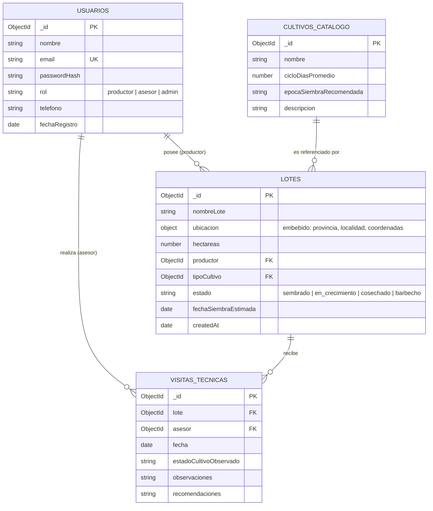

# Evaluación Bases de Datos: Diseño de Esquema
### Curso Avanzado Back-End — UTN
### Proyecto: Campo Argentino (plataforma de asesoría agropecuaria)

---

## 1. Elección del dominio

**Campo Argentino** es una plataforma de asesoría agropecuaria donde **productores** cargan sus lotes de campo y **asesores técnicos** los visitan y dejan recomendaciones sobre el cultivo en curso; un **administrador** gestiona usuarios y el catálogo de cultivos.

---

## 2. Diagrama del modelo



**Relaciones del modelo:**
- `Lotes.productor` → `Usuarios` (1:N — obligatoria, Usuario↔Entidad Principal)
- `Lotes.tipoCultivo` → `CultivosCatalogo` (1:N — obligatoria, Entidad Principal↔Entidad Referenciada)
- `VisitasTecnicas.lote` → `Lotes` (1:N — relación adicional)
- `VisitasTecnicas.asesor` → `Usuarios` (1:N — relación adicional)

---

## 3. Justificación de embeber vs. referenciar

**`tipoCultivo` se referencia (no se embebe) desde `Lotes`.**
El catálogo de cultivos (soja, maíz, trigo, girasol...) es un conjunto acotado de valores que se repite en cientos de lotes distintos. Si embebiéramos el objeto cultivo completo dentro de cada Lote, estaríamos duplicando la misma información (ciclo de días, época de siembra) en cada documento. Si mañana se corrige el `cicloDiasPromedio` de la soja, con referencia se actualiza **un solo documento** en `CultivosCatalogo`; embebido, habría que actualizar cada Lote uno por uno. Además el catálogo se consulta de forma independiente (por ejemplo, para poblar un combo en el formulario de alta de lote).

**`productor` y `asesor` se referencian desde `Lotes` y `VisitasTecnicas`.**
Un Usuario existe de forma independiente del Lote o la Visita: el mismo productor tiene varios lotes, el mismo asesor hace varias visitas, y sus datos (email, teléfono) se consultan y actualizan por fuera de ambas colecciones. Embeberlos duplicaría datos personales en cada documento y los desincronizaría en cuanto el usuario cambie su teléfono o email.

**`ubicacion` sí se embebe dentro de `Lotes`.**
A diferencia del cultivo, la ubicación (provincia, localidad, coordenadas) es un dato que **no se reutiliza en ningún otro lado**: pertenece exclusivamente a ese lote, no se comparte entre lotes distintos, y siempre se lee junto con el resto del documento del Lote (no tiene sentido consultarla de forma aislada). Embeberla evita un `populate`/`join` innecesario para un dato que en el 100% de los casos se usa junto a su padre.

---

## 4. Índices propuestos

| Índice | Colección | Para qué sirve |
|---|---|---|
| Único en `email` | `Usuarios` | Evitar usuarios duplicados con el mismo email (usado además para login). |
| En `productor` | `Lotes` | Acelerar la consulta "traer todos los lotes de este productor" (pantalla principal del productor). |
| En `tipoCultivo` | `Lotes` | Acelerar filtros por tipo de cultivo (ej. "mostrar todos los lotes sembrados con soja"). |
| Compuesto en `{ lote, fecha: -1 }` | `VisitasTecnicas` | Traer rápido el historial de visitas de un lote ordenado de la más reciente a la más vieja. |
| En `asesor` | `VisitasTecnicas` | Acelerar "mis visitas realizadas" desde la vista del asesor. |
| `2dsphere` en `ubicacion.coordenadas` | `Lotes` | Habilitar búsquedas geoespaciales (ej. "lotes cercanos a mi zona") si se agrega esa funcionalidad más adelante. |

---

## 5. Documentos de ejemplo

### Colección `usuarios`

```json
[
  {
    "_id": "652f1a1b2c3d4e5f60000001",
    "nombre": "Marcos Beltrán",
    "email": "marcos.beltran@campoargentino.com",
    "passwordHash": "$2b$10$examplehash01",
    "rol": "productor",
    "telefono": "+54 9 11 5555-0001",
    "fechaRegistro": "2026-02-10T00:00:00Z"
  },
  {
    "_id": "652f1a1b2c3d4e5f60000002",
    "nombre": "Lucía Fernández",
    "email": "lucia.fernandez@campoargentino.com",
    "passwordHash": "$2b$10$examplehash02",
    "rol": "productor",
    "telefono": "+54 9 341 555-0002",
    "fechaRegistro": "2026-03-02T00:00:00Z"
  },
  {
    "_id": "652f1a1b2c3d4e5f60000003",
    "nombre": "Ing. Agr. Diego Ríos",
    "email": "diego.rios@campoargentino.com",
    "passwordHash": "$2b$10$examplehash03",
    "rol": "asesor",
    "telefono": "+54 9 351 555-0003",
    "fechaRegistro": "2026-01-20T00:00:00Z"
  },
  {
    "_id": "652f1a1b2c3d4e5f60000004",
    "nombre": "Admin Campo Argentino",
    "email": "admin@campoargentino.com",
    "passwordHash": "$2b$10$examplehash04",
    "rol": "admin",
    "telefono": "+54 9 11 5555-0004",
    "fechaRegistro": "2026-01-01T00:00:00Z"
  }
]
```

### Colección `cultivos_catalogo`

```json
[
  {
    "_id": "652f1a1b2c3d4e5f60001001",
    "nombre": "Soja",
    "cicloDiasPromedio": 140,
    "epocaSiembraRecomendada": "Octubre - Noviembre",
    "descripcion": "Cultivo de verano, sensible al fotoperíodo."
  },
  {
    "_id": "652f1a1b2c3d4e5f60001002",
    "nombre": "Maíz",
    "cicloDiasPromedio": 150,
    "epocaSiembraRecomendada": "Septiembre - Octubre",
    "descripcion": "Alta demanda de nitrógeno, requiere buena disponibilidad hídrica."
  },
  {
    "_id": "652f1a1b2c3d4e5f60001003",
    "nombre": "Trigo",
    "cicloDiasPromedio": 180,
    "epocaSiembraRecomendada": "Mayo - Julio",
    "descripcion": "Cultivo de invierno, cosecha en verano."
  },
  {
    "_id": "652f1a1b2c3d4e5f60001004",
    "nombre": "Girasol",
    "cicloDiasPromedio": 130,
    "epocaSiembraRecomendada": "Octubre - Noviembre",
    "descripcion": "Buena tolerancia a suelos con menor fertilidad."
  }
]
```

### Colección `lotes`

```json
[
  {
    "_id": "652f1a1b2c3d4e5f60002001",
    "nombreLote": "Lote El Trébol",
    "ubicacion": {
      "provincia": "Santa Fe",
      "localidad": "Cañada de Gómez",
      "coordenadas": { "lat": -32.8256, "lng": -61.4023 }
    },
    "hectareas": 85,
    "productor": "652f1a1b2c3d4e5f60000001",
    "tipoCultivo": "652f1a1b2c3d4e5f60001001",
    "estado": "en_crecimiento",
    "fechaSiembraEstimada": "2026-10-15T00:00:00Z",
    "createdAt": "2026-08-01T00:00:00Z"
  },
  {
    "_id": "652f1a1b2c3d4e5f60002002",
    "nombreLote": "Lote La Esperanza",
    "ubicacion": {
      "provincia": "Córdoba",
      "localidad": "Marcos Juárez",
      "coordenadas": { "lat": -32.6997, "lng": -62.1043 }
    },
    "hectareas": 120,
    "productor": "652f1a1b2c3d4e5f60000001",
    "tipoCultivo": "652f1a1b2c3d4e5f60001002",
    "estado": "sembrado",
    "fechaSiembraEstimada": "2026-09-20T00:00:00Z",
    "createdAt": "2026-08-05T00:00:00Z"
  },
  {
    "_id": "652f1a1b2c3d4e5f60002003",
    "nombreLote": "Lote Don Alberto",
    "ubicacion": {
      "provincia": "Buenos Aires",
      "localidad": "Pergamino",
      "coordenadas": { "lat": -33.8969, "lng": -60.5735 }
    },
    "hectareas": 60,
    "productor": "652f1a1b2c3d4e5f60000002",
    "tipoCultivo": "652f1a1b2c3d4e5f60001003",
    "estado": "cosechado",
    "fechaSiembraEstimada": "2026-06-01T00:00:00Z",
    "createdAt": "2026-05-15T00:00:00Z"
  },
  {
    "_id": "652f1a1b2c3d4e5f60002004",
    "nombreLote": "Lote San Isidro",
    "ubicacion": {
      "provincia": "Santa Fe",
      "localidad": "Venado Tuerto",
      "coordenadas": { "lat": -33.7461, "lng": -61.9689 }
    },
    "hectareas": 45,
    "productor": "652f1a1b2c3d4e5f60000002",
    "tipoCultivo": "652f1a1b2c3d4e5f60001004",
    "estado": "barbecho",
    "fechaSiembraEstimada": "2026-10-25T00:00:00Z",
    "createdAt": "2026-08-10T00:00:00Z"
  }
]
```

### Colección `visitas_tecnicas`

```json
[
  {
    "_id": "652f1a1b2c3d4e5f60003001",
    "lote": "652f1a1b2c3d4e5f60002001",
    "asesor": "652f1a1b2c3d4e5f60000003",
    "fecha": "2026-08-05T14:00:00Z",
    "estadoCultivoObservado": "Emergencia pareja, sin plagas visibles",
    "observaciones": "Suelo con buena humedad tras las últimas lluvias.",
    "recomendaciones": "Monitorear en 15 días por posible presencia de orugas."
  },
  {
    "_id": "652f1a1b2c3d4e5f60003002",
    "lote": "652f1a1b2c3d4e5f60002002",
    "asesor": "652f1a1b2c3d4e5f60000003",
    "fecha": "2026-08-12T10:30:00Z",
    "estadoCultivoObservado": "Siembra reciente, aún sin emergencia",
    "observaciones": "Condiciones climáticas favorables para el desarrollo inicial.",
    "recomendaciones": "Revisar densidad de siembra en próxima visita."
  },
  {
    "_id": "652f1a1b2c3d4e5f60003003",
    "lote": "652f1a1b2c3d4e5f60002003",
    "asesor": "652f1a1b2c3d4e5f60000003",
    "fecha": "2026-06-20T09:00:00Z",
    "estadoCultivoObservado": "Cultivo cosechado, rastrojo en buen estado",
    "observaciones": "Rendimiento dentro de lo esperado para la zona.",
    "recomendaciones": "Evaluar rotación con soja para la próxima campaña."
  },
  {
    "_id": "652f1a1b2c3d4e5f60003004",
    "lote": "652f1a1b2c3d4e5f60002004",
    "asesor": "652f1a1b2c3d4e5f60000003",
    "fecha": "2026-08-14T16:00:00Z",
    "estadoCultivoObservado": "Lote en barbecho, sin cultivo actual",
    "observaciones": "Buen nivel de cobertura de rastrojo previo.",
    "recomendaciones": "Confirmar fecha de siembra según pronóstico de lluvias de octubre."
  }
]
```
